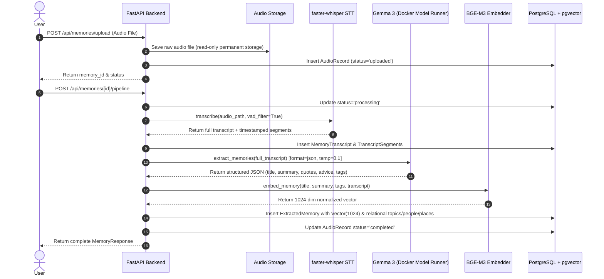
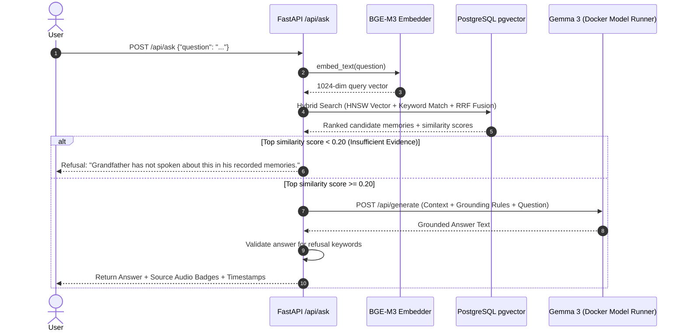
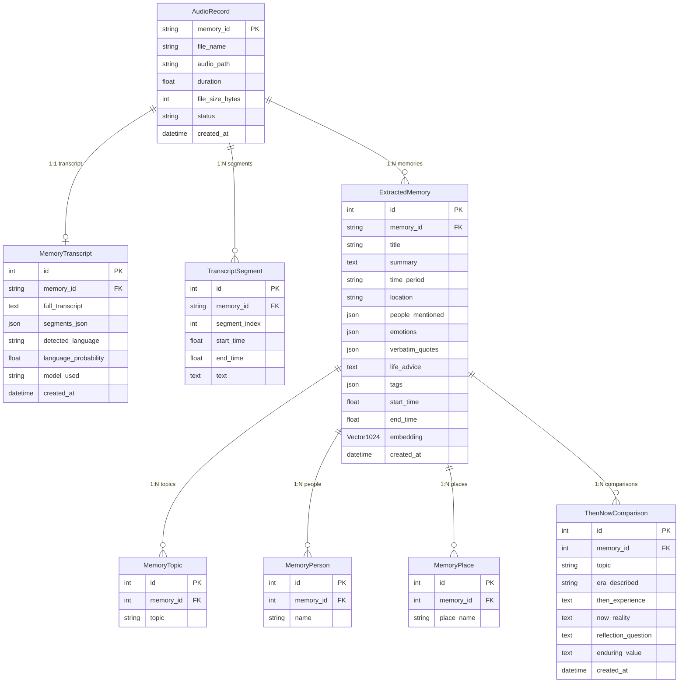

# Deep Technical Architecture

## 1. System Overview

**Echoes of an Era** is an end-to-end local AI platform designed for audio memory preservation, structured archival extraction, high-dimensional vector search, evidence-grounded Q&A, and historical comparison.

The platform enforces a strict separation between **authentic historical artifacts** (the grandfather's original voice recordings) and **interpretive AI analysis**. The system never relies on cloud-hosted LLM endpoints or proprietary black-box APIs, running entirely on open-weight models and local infrastructure.

---

## 2. System Architecture Diagram

```mermaid
graph TB
    subgraph Frontend Client Layer
        React[React 18 SPA UI]
        Router[React Router DOM]
        AudioComp[Docked Audio Player]
        APIClient[Client API Layer - api.js]
    end

    subgraph Backend Layer FastAPI
        FastAPIApp[FastAPI Core Application]
        MemoriesAPI[/api/memories Router]
        AskAPI[/api/ask Router]
        CompareAPI[/api/compare Router]
        SearchAPI[/api/search Router]
        
        STTService[TranscriptionService - faster-whisper]
        EmbedService[EmbeddingService - BAAI/bge-m3]
        ExtractService[MemoryExtractorService]
        RetrieverService[RetrievalService - Hybrid Engine]
        RAGService[RAGService - Grounded QA]
        CompService[ComparisonService - Then vs Now]
    end

    subgraph Local LLM Engine
        DMR[Docker Model Runner]
        GemmaModel[Gemma 3 1B Q4_K_M]
    end

    subgraph Storage & Database Layer
        Postgres[(PostgreSQL 16)]
        PGVector[pgvector Extension]
        HNSW[HNSW Vector Index]
        AudioStore[File Storage ./uploads/audio]
    end

    React --> Router
    React --> AudioComp
    React --> APIClient
    APIClient -->|HTTP / JSON| FastAPIApp

    FastAPIApp --> MemoriesAPI
    FastAPIApp --> AskAPI
    FastAPIApp --> CompareAPI
    FastAPIApp --> SearchAPI

    MemoriesAPI --> STTService
    MemoriesAPI --> ExtractService
    MemoriesAPI --> EmbedService
    
    SearchAPI --> RetrieverService
    AskAPI --> RAGService
    CompareAPI --> CompService

    RAGService --> RetrieverService
    RAGService -->|JSON Prompt| DMR
    ExtractService -->|JSON Prompt| DMR
    CompService -->|JSON Prompt| DMR
    DMR --> GemmaModel

    RetrieverService --> EmbedService
    RetrieverService -->|Cosine Sim Query| PGVector
    EmbedService -->|1024-dim Vector| PGVector
    PGVector --> HNSW
    Postgres --> PGVector
    
    MemoriesAPI -->|Audio Stream| AudioStore
    STTService -->|Read Audio| AudioStore
```

---

## 3. Component Architecture

### Frontend Layer
- **Framework:** React 18 with Vite.
- **Styling:** Tailwind CSS with custom glassmorphism design tokens (`glass-panel`, amber gold accent palette, custom typography).
- **Audio Subsystem:** Global state-driven audio player (`AudioPlayer`) docked to the bottom of the screen. Supports jump-cutting to precise floating-point second timestamps (`initialTime`), auto-play, custom progress seeking, and volume control.

### Backend Layer
- **Framework:** FastAPI (Python 3.10+).
- **ORM:** SQLAlchemy 2.0 with `psycopg` PostgreSQL driver.
- **Media Streaming:** Standard `FileResponse` with HTTP `Accept-Ranges: bytes` headers for native browser streaming and audio scrubbing.

### AI Infrastructure
- **LLM Runtime:** Gemma 3 1B Q4_K_M running locally through Docker Model Runner (`docker model`) exposed on port `12434`.
- **Embedding Engine:** `BAAI/bge-m3` running locally via Hugging Face `SentenceTransformers` on PyTorch.
- **STT Engine:** `faster-whisper` (`large-v3-turbo`) with PyAV and CTranslate2.

---

## 4. Memory Ingestion Pipeline



---

## 5. Query / RAG Pipeline



---

## 6. Embedding Architecture

- **Model:** `BAAI/bge-m3` (BAAI BGE Multi-Lingual High-Density Embedding).
- **Vector Dimensions:** Exactly 1024 dimensions.
- **Normalization:** Vectors are L2-normalized ($|v|_2 \approx 1.0$) upon generation.
- **Composite Text Representation:**
  To maximize semantic density, the model does not embed raw transcripts alone. Instead, it embeds a composite representation:
  ```text
  Title: <title>
  Summary: <summary>
  Topics: <topic_1, topic_2, ...>
  Transcript: <verbatim_transcript_text>
  ```
- **Local Enforcement:** `EMBEDDING_LOCAL_ONLY=true`. Loads strictly from local Hugging Face cache. Fallback script `backend/download_bge_m3.py` pre-warms the cache. Disallows vector truncation, padding, or fallback to lower-dimensional models.

---

## 7. LLM Architecture

- **Model:** `gemma3:1B-Q4_K_M` (Gemma 3 1B 4-bit quantized).
- **LLM Runtime:** Gemma 3 1B Q4_K_M running locally through Docker Model Runner (`docker model`).
- **Generation Parameters:**
  - **Memory Extraction:** `temperature: 0.1`, `top_p: 0.9`, `format: "json"`. Lower temperature ensures strict JSON structure without creative addition.
  - **Grounded Q&A (RAG):** `temperature: 0.2`, `top_p: 0.85`. Conservative temperature for strict factual adherence to context.
  - **Then vs Now Comparison:** `temperature: 0.2`, `top_p: 0.85`, `format: "json"`. Structured breakdown contrasting historical experience with modern context.

---

## 8. Grounding Strategy

To prevent AI hallucination, the system enforces a multi-tiered guardrail:

1. **Retrieval Threshold Filter:** Candidates with hybrid scores below $0.15$ are filtered out.
2. **Score Floor Guard:** If the top candidate score is below $0.20$, retrieval is treated as empty.
3. **Refusal Guardrail:** When context is insufficient, the system outputs the standardized refusal:
   > *"Grandfather has not spoken about this in his recorded memories."*
4. **Prompt Constraints:** Prompts explicitly instruct Gemma 3:
   - "Rely ONLY on the provided memory facts."
   - "Do NOT use outside historical knowledge to invent personal events."
   - "If the memory facts do not contain the answer, explicitly state that he has not mentioned it."
5. **Citations & Verbatim Quotes:** Answers must link to extracted `verbatim_quotes` and audio timestamps.

---

## 9. Audio Source Architecture

- **Audio Preservation:** Uploaded audio files are stored in `./uploads/audio` named `{memory_id}_{original_filename}`. The raw file is strictly read-only and never modified or re-encoded.
- **Duration & Metadata Extraction:** Uses `PyAV` container inspection to read exact duration without decoding full audio buffers into RAM.
- **Streaming Server:** FastAPI serves original audio via `/api/memories/audio/{memory_id}/stream` with HTTP Range headers (`206 Partial Content`), allowing immediate seek operations on mobile and desktop browsers.

---

## 10. Data Model (Entity-Relationship Diagram)



---

## 11. Security and Privacy Considerations

- **Local Processing:** All models (Gemma 3 1B Q4_K_M, BGE-M3, Whisper) execute locally. No voice audio or transcripts are sent to third-party public AI APIs.
- **Git Protection:** `.gitignore` explicitly excludes `.env`, `uploads/`, `backend/uploads/`, and audio extensions (`*.mp3`, `*.wav`, `*.m4a`).
- **Sanitized Filenames:** Filenames are sanitized on upload to prevent path traversal attacks.

---

## 12. Error Handling

- **STT Fallbacks:** If the requested Whisper model size fails to load, `transcription_service` attempts a fallback to `large-v3-turbo` or `tiny`.
- **JSON Parsing Resilience:** `ComparisonService` and `MemoryExtractorService` implement regex-based JSON extraction fallbacks if LLM output contains stray markdown formatting.
- **Streaming Audio Fallbacks:** If a requested memory ID's audio file path is moved, the backend resolves the file via directory scanning to ensure continuous audio availability.

---

## 13. Performance Considerations

- **Vector Search Optimization:** Uses HNSW vector indexes in `pgvector` for sub-millisecond similarity queries over 1024-dimensional space.
- **Pre-Warmed Models:** Embedding models are pre-warmed on backend startup (`main.py`) to eliminate first-query latency.
- **Batch Processing:** Supports `POST /api/memories/process_all_pending` for bulk background ingestion.

---

## 14. Deployment Architecture

- **Current State:** Designed for local workstation execution via Docker Compose (PostgreSQL + pgvector container), Docker Model Runner (Gemma 3 container/process), and Uvicorn FastAPI backend.
- **Storage:** Local host volume mounting (`./data/postgres` for DB state, `./uploads/audio` for audio files).

---

## 15. Future Architecture

- **Distributed Vector Indexing:** Scaling vector search usingpgvector IVFFlat/HNSW tuning for thousands of hours of audio.
- **Audio Diarization Engine:** Integrating PyAnnote or WhisperX for multi-speaker diarization in group recordings.
